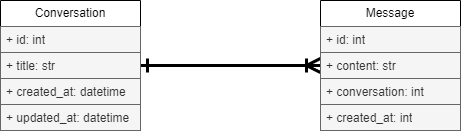

# Directory Structure

```bash
backend/
│── app/
│   ├── routers/
│   │   ├── conversations.py     # conversation endpoints
│   ├── database.py     # Database connection logic
│   ├── main.py         # Entry point for FastAPI app
│   ├── models.py       # Database models
│── tests/
│   ├── test_conversations.py   # Test cases for conversations
```

# Technology Stack

- **Language**: [Python](https://www.python.org/)
- **Framework**: [FastAPI](https://fastapi.tiangolo.com/)
- **Database**: [SQLite](https://www.sqlite.org/)
- **Testing**: [pytest](https://docs.pytest.org/en/latest/)

# Usage Instructions

## 1. Set up Environment Variables

```bash
DATABASE_URL = ""
```

## 2. Run the Application Locally

Run the following command to start the application locally (on linux):

```bash
cd backend
. full_setup.sh
```

## 3. Interact with the API

Go to [http://localhost:8000/docs](http://localhost:8000/docs) to view the API documentation.

# Design Decisions

## FastAPI Backend

Seeking to leverage past experience and wanting to get up and running quickly, FastAPI was chosen as the backend framework for its simplicity. Django was considered, but was ultimately rejected due to its added overhead that I deemed would go unused.

## SQLite Database

Similiar to the choice to use FastAPI, SQLite was chosen for its simplicity and ease of use.

## Patch vs. Put

The decision to use `PATCH` instead of `PUT` was made with the assumption and expectation that data models would only ever have a few mutable fields and not require the entire object to be replaced. Thus `PATCH` was chosen to align with this expectation.

# API Reference

| Endpoint | Method | Description |
| -------- | ------ | ----------- |
| /conversation         | POST   | Create a new conversation |
| /conversation         | GET    | Retrieve all existing conversations |
| /conversation/{id}    | GET    | Retrieve an existing conversation |
| /conversation/{id}    | PATCH    | Update an existing conversation |
| /conversation/{id}    | DELETE | Delete an existing conversation, and **all** associated messages |

# Database and Model Reference

## UML Diagram



## Conversation

Represents a conversation between the user and the agent.
Serves as the main foriegn key of `Messages` to link them together.

| Field | Type | Mutable |  Description |
| ----- | ---- | ------- | ------------ |
| id | int | False | Primary key |
| title | str | True | Title of the conversation |
| created_at | datetime | False | Timestamp of creation |
| updated_at | datetime | False | Timestamp of last update |

## Message

Represents a message from either the user or the agent.

| Field | Type | Mutable |  Description |
| ----- | ---- | ------- | ------------ |
| id | int | False | Primary key |
| conversation_id | int | False | Foreign key to `Conversation` |
| content | str | True | Content of the message |
| created_at | datetime | False | Timestamp of creation |

# Logging Reference

# Development Notes and Future Improvements